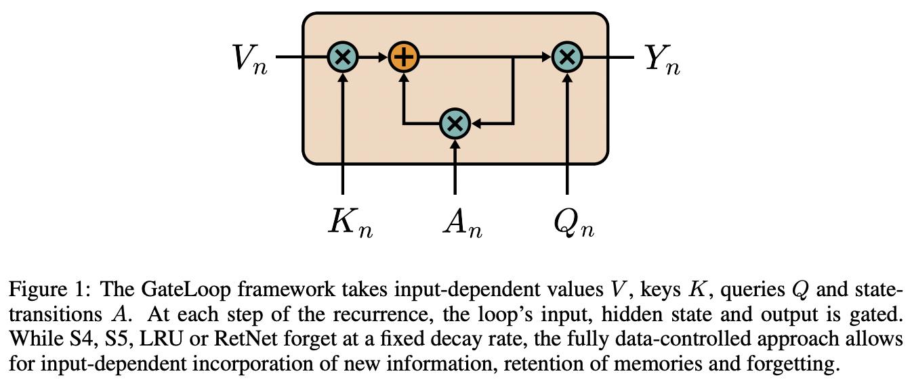

</img>

## GateLoop Transformer (wip)

Implementation of <a href="https://arxiv.org/abs/2311.01927">GateLoop</a> Transformer in Pytorch and Jax, to be tested on Enwik8 character level modeling.

Update: A transformer run with regular attention + data dependent xpos relative positions did not converge at all. Also, gate loop's associative scan also is not able to train on even sequence lengths of 128. I'm not sure if it can be done without a specialized CUDA kernel, much like autoregressive linear attention (RWKV and the like)

Update 2: Got a smaller GateLoop transformer (gate loop dimensions of 128) to run on sequence length of 256. It is converging very well with a quick eyeball. Will run some more rigorous experiments tomorrow.

Update 3: Fixed a misunderstanding and definitely seems to be converging better than vanilla linear attention (from my memories of those experiments).

Update 4: <a href="https://api.wandb.ai/links/lucidrains/ysbz84fn">Ongoing experiments</a>

Update 5: Author has reviewed the code, and there was another misunderstanding. They use maximum heads (heads == dimension). This is kind of a plot twist, as this is infeasible for normal attention. It also obviates the need a fused CUDA kernel as in autoregressive linear attention.

Update 6: Corrected gateloop transformer run looks amazing. Cautiously optimistic now.

### Install

```bash
$ pip install gateloop-transformer
```

### Usage

```python
import torch
from gateloop_transformer import Transformer

model = Transformer(
    num_tokens = 256,
    dim = 624,
    depth = 6,
    use_gate_looped_attn = True
)

ids = torch.randint(0, 256, (1, 1024))
logits = model(ids) # (1, 1024, 256)
```

### Character-level Language Modeling

Install requirements

```bash
$ pip install -r requirements.txt
```

Then run the `train.py` script for autoregressive modeling on enwik8

```bash
$ python train.py
```

### Todo

- [ ] do all the ablations and figure out how much the data controlled state transitions adds (as well as whether it needs to be complex)

- [x] start with naive memory checkpointing of gate loop operation
- [x] retry the failed full attention experiments (with data dependent xpos), but with complex valued scales (didn't work)

## Citations

```bibtex
@inproceedings{Katsch2023GateLoopFD,
    title   = {GateLoop: Fully Data-Controlled Linear Recurrence for Sequence Modeling},
    author  = {Tobias Katsch},
    year    = {2023},
    url     = {https://api.semanticscholar.org/CorpusID:265018962}
}
```
